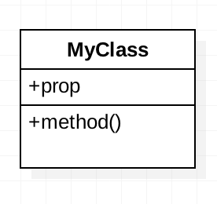
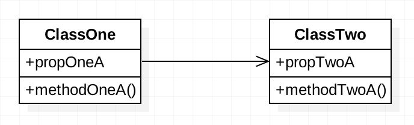
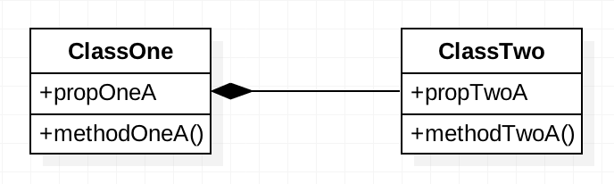

# Le diagramme de classe

Le diagramme de classe est une étape supplémentaire.

On va analyser notre service au-délà de ses utilisateurs et se pencher sur tout les **acteurs/éléments** qui le constituent et comment ils **intéragissent** les uns avec les autres.

Bien fait il nous permettra de définir les différentes classes qu’on utilisera dans notre code.
Certains plugins permettent même de générer son code directement à partir d’un diagramme de classe.
--------------
## Les éléments de construction du diagramme.
+ La **définition** d’une classe :
On définit une classe par ses **propriétés** et ses **méthodes**.

+ Les **différents types d’associations** entre deux classes :
    + **L’association simple**. un Animal utilise/crée un Outil. L’outil a besoin de l’animal pour être créer. L’animal a besoin d’utiliser l’outil. il y a une relation de co-dépendance.
    
    

    + **L’association directe**. un Animal respire de l’Air. L’animal utilise l’air sans interruption. L’animal ne vit pas sans air, l’air peut vivre sans animal.
    
    

    + **L’association temporaire**. un Animal mange de la nourriture. L’animal utilise ponctuellement la nourriture. L’animal ne vit pas sans nourriture, la nourriture vit sans l’animal.
    
    

    + **L'association d’héritage**. L’Homme est un Animal. Tout les animaux ne sont pas des hommes. Tout les hommes ont les mêmes propriétés et méthodes que les animaux (squelette, respiration(),… ). Tout les animaux n’ont pas les mêmes propriétés que l’homme (pouceOppose, marcherDebout()).
    
    

    + **L’association de composition**. un Animal a un Coeur. L’un fait partie de l’autre et l’un ne vit pas sans l’autre.
    
    

    + **L’association d'agrégation**. un Animal a un Territoire. Les deux sont indépendants l’un de l’autre. L’animal peut survivre hors de son territoire et inversement. Le Territoire a des propriétés et des méthodes qui ne sont pas liés à l’animal et inversement.
    
    

+ Pour chaque type d’association on peut définir une **quantité** de l’un vers l’autre.

--------------
## Case study Fixeez
Quand on crée un service, on ne va pas forcément créer toutes les features directement. Mais quand on crée les classes ça peut être un gain de temps de penser au résultat final, ça permet d’avoir une solution **scalable** ( évolutive ).

### La première version de mon service.
C’est une version simplifiée qui se concentre sur un produit et s’appuie sur quelques réparateurs et sera gérée par un administrateur :

+ L’_administrateur_ crée son _compte_.
+ Un _cycliste_ crée un _compte_.
+ Il renseigne son _vélo_.
+ Il déclare une _panne_.
+ L’_administrateur_ envoie un _réparateur_.

### La deuxième version de mon service.
C’est une version qui s’ouvre à plusieurs type de produits. Elle permet aux gens de s’inscrire en tant que réparateurs et sera gérée par plusieurs administrateurs :

+ Les _comptes_ utilisent des _Tokens_.
+ Un _administrateur_ crée un _compte_.
+ Un _réparateur_ crée un _compte_.
+ Un _cycliste_ crée un _compte_ et renseigne un _produit_ qu’il voudra réparer et le _type de produit_ ( vélo, appareil photo, machine à coudre,… )
+ Il déclare une _panne_.
+ Le _réparateur_ accepte la _requête_.
+ Les _administrateurs_ supervisent les _requêtes_ et _comptes_.

### J’ai donc plusieurs classes :

+ Compte (User)
+ Admin
+ Fixer
+ Fixee
+ Produit (Prop)
+ Type (Bike)
+ Request

### Il me reste à définir les intéractions entre chaque classe.

+ Fixee, Fixer et Admin _héritent_ de Compte.
+ Bike _hérite_ de Prop.
+ Fixee, Fixer et Admin _utilise temporairement_ Request()
--------------
##Le diagramme

